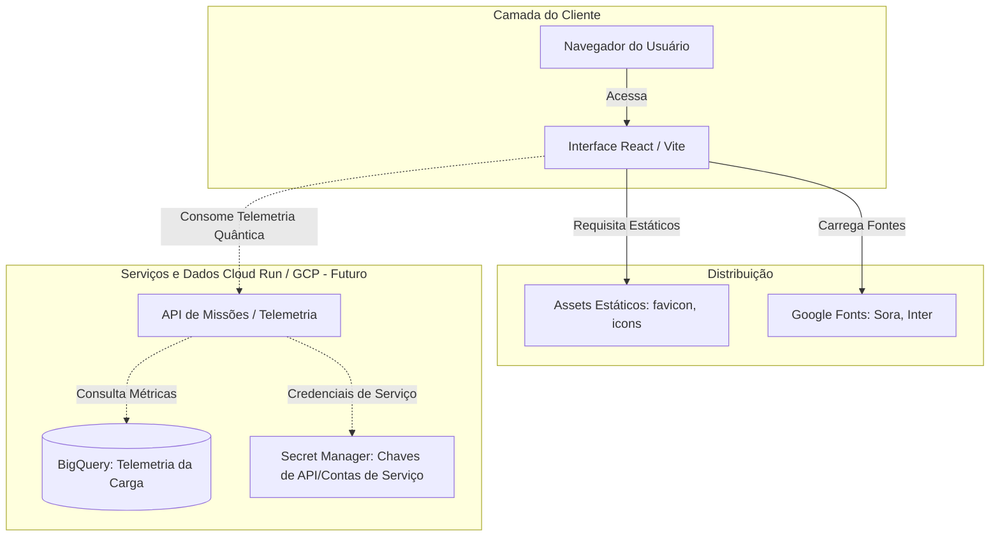

# LaunchPad | Space Logistics

Desenvolvimento prático de um protótipo conceitual orientado por Agente IA, utilizando Design System de alta performance para simulação de comercialização, monitoramento e gerenciamento de missões de transporte aeroespacial.

---

## 1. 📌 Visão Geral do Projeto

O **LaunchPad** é um **protótipo conceitual e prático** de uma interface de próxima geração (*Orbital Kinetic Design System*). Desenvolvido exclusivamente como um **projeto de simulação futurista**, o sistema simula um ambiente de comercialização, monitoramento e visualização de missões de transporte aeroespacial — cobrindo desde turismo orbital em órbitas terrestres baixas até a logística de cargas em operações lunares e interplanetárias profundas.

Este material serve como laboratório prático para explorar a integração de ferramentas modernas de desenvolvimento orientadas por IA, design de alta fidelidade e visualização de telemetria fictícia em tempo real.

### Objetivos de Negócio:
*   **Apresentação e Venda de Manifesto:** Interface otimizada para aquisição e reserva de manifestos de lançamento de cargas úteis em diferentes órbitas.
*   **Visualização Tecnológica:** Exposição simplificada das capacidades de engenharia orbital (propulsão submilimétrica, blindagem térmica/radiação e conexões de telemetria quântica).
*   **Base de Telemetria:** Estrutura visual preparada para receber dados em tempo real e telemetria de missões espaciais.

---

## 2. 🏛️ Arquitetura da Solução e Fluxo de Dados

A arquitetura do LaunchPad é focada em performance e estética futurista, projetada com a seguinte topologia conceitual:



### Papel de Cada Camada:
1.  **Frontend (React 19 + TailwindCSS):** Renderiza o ecossistema visual de alta fidelidade baseada no tema *Orbital Kinetic* (estética escura com brilhos e bordas neon).
2.  **Vite Bundler:** Compila os componentes com Hot Module Replacement (HMR) e empacota os arquivos estáticos de forma ultra-otimizada.
3.  **GCP Backend Integration (Planejado):** Infraestrutura escalável que consome dados estruturais diretamente do BigQuery e gerencia autenticações através do GCP Secret Manager.

---

## 3. 🛠️ Stack Tecnológica

As dependências e ferramentas centrais identificadas nos manifestos de configuração são:

| Categoria | Tecnologia / Biblioteca | Versão | Descrição |
| :--- | :--- | :--- | :--- |
| **Core** | [React](https://react.dev/) | `^19.2.8` | Biblioteca base para construção da UI declarativa. |
| **Build Tool** | [Vite](https://vite.dev/) | `^8.2.0` | Ferramenta de build rápida e empacotador de assets. |
| **Styling** | [TailwindCSS](https://tailwindcss.com/) | `^3.4.19` | Framework CSS utilitário para design sob medida. |
| **Processador CSS** | [PostCSS](https://postcss.org/) & [Autoprefixer](https://github.com/postcss/autoprefixer) | `^8.5` / `^10.5` | Suporte a prefixos e compatibilidade de navegadores. |
| **Linter** | [Oxlint](https://oxc.rs/docs/guide/usage/linter.html) | `^1.75.0` | Linter ultra-rápido para manter a consistência do código JS/JSX. |
| **Assets** | Google Fonts (Sora & Inter) | Cloud-hosted | Fontes display e funcionais especificadas no Design System. |

---

## 4. 📁 Estrutura do Diretório

A hierarquia real do projeto está dividida da seguinte forma:

```
LaunchPad-Project/
├── .gitignore               # Regras rígidas de segurança e exclusões do Git
├── .env.example             # Modelo sanitizado de variáveis de ambiente do projeto
├── .oxlintrc.json           # Configurações do linter Oxlint
├── index.html               # Ponto de entrada HTML e carregamento de fontes do Google
├── package.json             # Manifesto de dependências e scripts npm
├── postcss.config.js        # Configuração do compilador PostCSS
├── tailwind.config.js       # Definição do Design System e tokens de cor do LaunchPad
├── vite.config.js           # Configurações de plugins e build do Vite
│
├── public/                  # Assets públicos compartilhados diretamente
│   ├── favicon.svg          # Ícone de aba do navegador
│   └── icons.svg            # Conjunto de ícones vetoriais
│
├── src/                     # Código-fonte da aplicação
│   ├── App.css              # Estilos específicos da tela principal
│   ├── App.jsx              # Componente raiz da aplicação
│   ├── index.css            # Folha de estilos global e classes utilitárias (Ex: .glass-panel)
│   ├── main.jsx             # Ponto de entrada do React
│   │
│   ├── assets/              # Mídias e imagens internas
│   │   ├── hero.png         # Imagem de fundo do terminal orbital
│   │   └── react.svg        # Logo do React
│   │
│   └── components/          # Componentes modulares e reutilizáveis
│       ├── Navbar.jsx       # Barra de navegação com tema escuro e links rápidos
│       ├── Hero.jsx         # Seção de abertura com chamada principal e telemetria simulada
│       ├── Features.jsx     # Exibição de tecnologias e manobras orbitais
│       ├── Pricing.jsx      # Parâmetros de missão (Suborbital, Orbital e Espaço Profundo)
│       └── Footer.jsx       # Rodapé com informações e avisos de comando
```

---

## 5. ⚙️ Variáveis de Ambiente e Configuração (Sanitizadas)

O projeto requer a configuração das seguintes variáveis locais. Crie um arquivo `.env` baseado no modelo abaixo:

| Variável | Tipo | Descrição | Exemplo Seguro / Placeholder |
| :--- | :--- | :--- | :--- |
| `GCP_PROJECT_ID` | String | ID do projeto no Google Cloud Platform | `"seu-projeto-gcp-id"` |
| `GCP_REGION` | String | Região onde os serviços do GCP estão hospedados | `"us-central1"` |
| `GCP_KEY_FILE_PATH` | String | Caminho absoluto/relativo para a chave da Conta de Serviço | `"configs/service-account.json"` |
| `BIGQUERY_DATASET` | String | Nome do dataset no BigQuery para coleta de telemetria | `"telemetry_dataset"` |
| `BIGQUERY_TABLE` | String | Nome da tabela que registra os logs estruturais das missões | `"mission_logs"` |
| `PORT` | Number | Porta para execução do servidor de desenvolvimento/produção | `8080` |
| `NODE_ENV` | String | Ambiente em que a aplicação está rodando | `"development"` |

> [!IMPORTANT]
> **Nunca** versione o arquivo `.env` com valores reais. Certifique-se de que ele permaneça na lista de itens ignorados pelo Git.

---

## 6. 🚀 Como Executar Localmente

### Pré-requisitos
*   **Node.js:** Versão 18 ou superior.
*   **npm:** Versão 9 ou superior.

### Passo 1: Clonar e instalar dependências
```bash
# Navegue até o diretório do projeto
cd LaunchPad-Project

# Instale os pacotes npm
npm install
```

### Passo 2: Configurar variáveis locais
```bash
# Copie o arquivo de exemplo
cp .env.example .env
# (Opcional) Ajuste as variáveis locais no arquivo .env
```

### Passo 3: Executar em ambiente de desenvolvimento
```bash
# Inicia o servidor local do Vite
npm run dev
```
Abra o navegador em `http://localhost:5173` (ou na porta indicada pelo terminal).

### Passo 4: Executar Linting e Builds
```bash
# Executa a varredura do linter Oxlint
npm run lint

# Compila o projeto para o diretório /dist
npm run build
```

---

## 7. ☁️ Instruções de Build e Deploy (GCP)

Para empacotar a aplicação estática em um container e realizar o deploy para produção no **Google Cloud Run** ou hospedar no **Google Cloud Storage (GCS)**:

### Opção A: Deploy via Docker + Cloud Run (Recomendado para SPA e Node.js)

1.  **Criação do Dockerfile** (Exemplo de build multi-stage na raiz do projeto):
    ```dockerfile
    # Estágio de Build
    FROM node:18-alpine AS builder
    WORKDIR /app
    COPY package*.json ./
    RUN npm install
    COPY . .
    RUN npm run build

    # Estágio de Produção
    FROM nginx:stable-alpine
    COPY --from=builder /app/dist /usr/share/nginx/html
    EXPOSE 80
    CMD ["nginx", "-g", "daemon off;"]
    ```

2.  **Build da Imagem e Envio para o Artifact Registry:**
    ```bash
    # Autenticar no GCP
    gcloud auth login
    gcloud config set project seu-projeto-id

    # Fazer build da imagem no Cloud Build
    gcloud builds submit --tag gcr.io/seu-projeto-id/launchpad-frontend:latest
    ```

3.  **Deploy no Cloud Run:**
    ```bash
    gcloud run deploy launchpad-service \
      --image gcr.io/seu-projeto-id/launchpad-frontend:latest \
      --platform managed \
      --region us-central1 \
      --allow-unauthenticated
    ```

### Opção B: Hospedagem Estática no Cloud Storage

```bash
# Criar bucket configurado para website
gcloud storage buckets create gs://launchpad-web-bucket --location=us-central1

# Definir página principal e de erro
gcloud storage buckets update gs://launchpad-web-bucket --web-main-page-suffix=index.html --web-error-page=index.html

# Upload dos arquivos gerados pelo 'npm run build'
gcloud storage cp -r dist/* gs://launchpad-web-bucket/

# Conceder acesso público de leitura aos objetos
gcloud storage buckets add-iam-policy-binding gs://launchpad-web-bucket --member=allUsers --role=roles/storage.objectViewer
```

---

## 8. 💡 Sugestões de Evolução e Próximos Passos (Recomendações do Arquiteto)

Após inspeção e análise minuciosa do workspace, estas são as recomendações de arquitetura e segurança para as próximas sprints:

1.  **Migração para TypeScript:** O projeto atualmente utiliza arquivos `.jsx` JavaScript puros. Adicionar TypeScript (`.tsx`) garantirá tipagem forte, eliminando potenciais erros em tempo de execução ao receber respostas estruturadas de telemetria orbital.
2.  **Isolamento de Chaves e Credenciais (Segurança):** Certifique-se de que chaves privadas e contas de serviço do GCP *nunca* sejam embarcadas no código frontend ou salvas na pasta `public/`. Toda comunicação com o BigQuery ou serviços restritos do GCP deve ser mediada por uma API backend (ou Cloud Functions dedicada) com políticas de IAM restritas.
3.  **Integração Real de Telemetria:** Substituir os placeholders e animações estáticas presentes em `Hero.jsx` por conexões dinâmicas utilizando SSE (Server-Sent Events) ou WebSockets para exibir métricas orbitais reais da API.
4.  **Otimização de Carregamento de Fontes:** As fontes Sora e Inter estão sendo requisitadas diretamente do Google Fonts via tags `<link>` externas no `index.html`. Em um ambiente com conectividade instável ou restritiva (comum em salas de controle aeroespaciais), recomenda-se hospedar as fontes localmente na pasta `public/assets/fonts/` e carregá-las no `index.css`.
