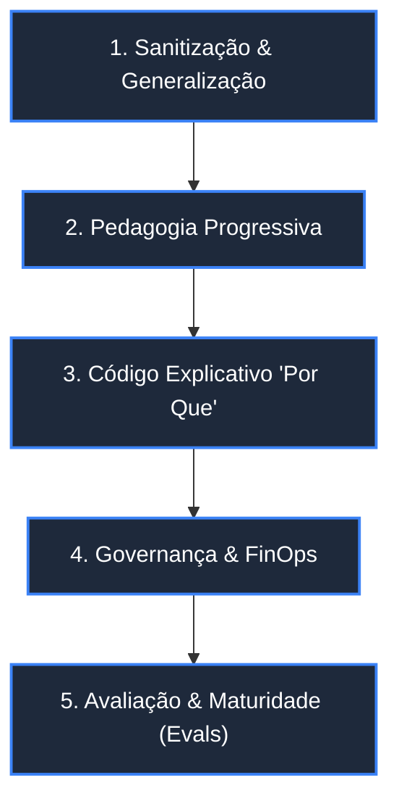
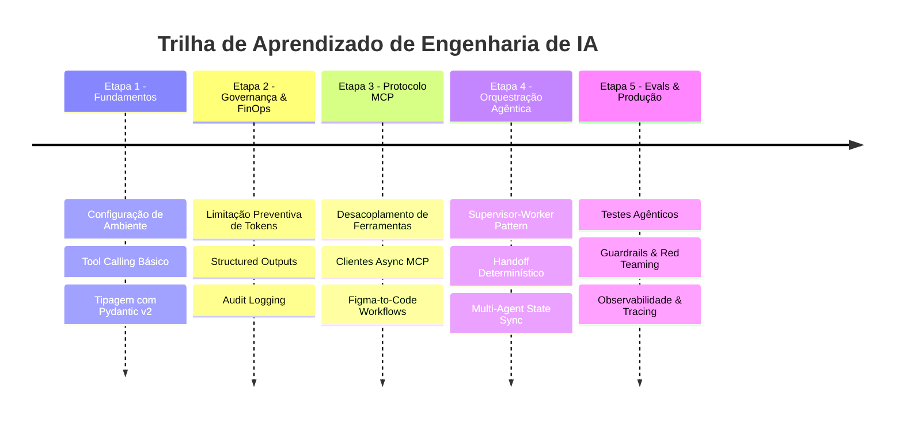

# 🎓 Mentor-IA: AI Engineering Enablement & CoE Framework

> **Framework de Formação de Equipes, Governança de IA & Capacitação Técnica de Elite**  
> *Transformando desenvolvedores de software em Engenheiros e Arquitetos de IA Agêntica.*

---

[](LICENSE)
[](https://www.python.org/)
[]()
[]()

---

## 🎯 Objetivo Estratégico

Este repositório foi desenvolvido para apoiar a **formação de equipes, o desenvolvimento de lideranças técnicas e a estruturação de Centros Profissionais de Excelência em IA**.

Seu foco é oferecer uma **abordagem pedagógica prática e acolhedora** para guiar desenvolvedores e times de engenharia no uso responsável de LLMs. Por meio de templates sanitizados e playbooks claros, buscamos incentivar o aprendizado contínuo, a inovação colaborativa e a evolução da maturidade técnica em qualquer organização.

---

## 🏛️ Os 5 Pilares Metodológicos da Mentoria

Para garantir que os playbooks e templates entreguem valor pedagógico de nível executivo e técnico, este repositório é sustentado por 5 pilares fundamentais:



1. 🔒 **Sanitização de Domínio & Generalização Canônica**: Remoção total de regras de negócio fechadas, credenciais ou esquemas confidenciais. Utilização de entidades genéricas padronizadas (ex: `Task`, `Order`, `DocumentChunk`, `GenericEntity`).
2. 📈 **Pedagogia Técnica Progressiva (Roteiro em Etapas)**: Documentação orientada a jornadas, guiando o desenvolvedor desde o *"Zero Setup"* (ambiente e chamadas simples) até padrões avançados de orquestração agêntica hierárquica.
3. 💡 **Comentários de Código "Por Que" (Architecture & Pitfalls)**: O código de template (`template/src/`) foca na razão das decisões de design, alertando sobre armadilhas comuns de concorrência, estouro de contexto e vazamento de prompt.
4. 🛡️ **Playbooks de Governança & Boas Práticas (`docs/`)**: Guias de suporte corporativo focados em **Consumo de Tokens & FinOps**, **Integração Figma-to-Code com MCP** e **Padrões de Testes Agênticos (Agentic Testing)**.
5. 📊 **Métricas de Impacto, Evals & AI Maturity Assessment**: Framework para medição contínua da qualidade do output dos agentes, determinismo de execução, observabilidade e progressão dos níveis de maturidade dos times.

---

## 📦 Starter Kits & Templates de Referência

O repositório está organizado em **Starter Kits pedagógicos prontos para consumo**, demonstrando padrões arquiteturais reais:

| Starter Kit | Padrão Arquitetural | Tecnologias Chave | Nível |
| :--- | :--- | :--- | :--- |
| 🎤 [**template-conferencia-tecnica**](./template-conferencia-tecnica) | Multi-Agente Hierárquico (Supervisor-Worker) | Google ADK / Gemini 3.5, Pydantic v2, MCP Protocol, FinOps | Advanced |
| 🏠 [**template-agente_ia_para-noticias-imobiliarias**](./template-agente_ia_para-noticias-imobiliarias) | Agente Extrator & RAG com Web Scraping | Python, Scraping, Vector Search, Structured JSON Output | Intermediate |
| 📋 [**template-to-do-list-project-v01**](./template-to-do-list-project-v01) | Agente CRUD Assistivo & Gestão de Tarefas | Clean Architecture, Pydantic, Tool Calling, Local State | Starter |

---

## 🗺️ Trilha de Capacitação (Learning Path)



---

## 📚 Estrutura do Repositório

```text
Mentor-IA/
├── template-conferencia-tecnica/               # Template Multi-Agente + MCP + FinOps
│   ├── .antigravity/                          # Configurações do Antigravity IDE / Agents
│   ├── docs/                                  # Guias detalhados do template
│   ├── template/                              # Código-fonte sanitizado e comentado
│   └── README.md                              # Guia do Starter Kit
├── template-agente_ia_para-noticias-imobiliarias/ # Template RAG & Extraction Agent
│   ├── docs/
│   ├── template/
│   └── README.md
├── template-to-do-list-project-v01/           # Template Agentic CRUD Starter
│   ├── docs/
│   ├── template/
│   └── README.md
└── docs/                                      # Playbooks Globais de Governança & CoE
    ├── finops-and-token-governance.md
    ├── mcp-figma-to-code-guide.md
    ├── agentic-testing-patterns.md
    └── ai-maturity-matrix.md
```

---

## 🚀 Como Utilizar Este Repositório

### Para Líderes de Tecnologia & Managers
- Utilize a matriz de maturidade em `docs/ai-maturity-matrix.md` para diagnosticar o estado atual dos seus times.
- Aplique os playbooks de FinOps para estabelecer travas de orçamento e prevenir estouro de custos em API de LLMs.

### Para Desenvolvedores & Alunos de Mentoria
1. Escolha um **Starter Kit** alinhado com o seu desafio técnico atual.
2. Siga o guia `README.md` interno de cada pasta para setup em 3 passos.
3. Inspecione os comentários de código da pasta `template/src/` para compreender os padrões arquiteturais por trás das escolhas de design.

---

## ✉️ Contato & Mentoria

Para saber mais sobre os programas de mentoria, palestras, consultorias de estruturação de Centros de Altaperformance em IA ou treinar seu time de engenharia:

- **Autor:** Leonardo da Fonseca Souza
- **Repositório GitHub:** [Mentor-IA](https://github.com/Leonardo-da-Fonseca-Souza/Mentor-IA)
