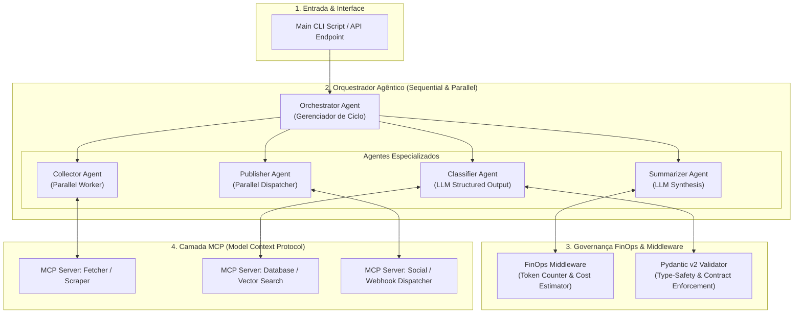

# 🎓 Starter Kit: Orquestração Multi-Agente & Governança FinOps

> **Template Educacional & Starter Kit de Engenharia Agêntica**  
> *Pilar Mentor-IA · Versão 1.0.0 · MLOps & Agentic Engineering Chapter*

---

## 📌 Visão Geral

Este repositório é um **Starter Kit educacional e reutilizável** projetado para capacitar desenvolvedores full-stack, engenheiros de dados e arquitetos na construção de **Sistemas Agênticos Corporativos de Alto Desempenho**.

Ele abstrai os padrões fundamentais de orquestração multi-agente (Google ADK / LangGraph), desacoplamento de ferramentas via **MCP (Model Context Protocol)**, validação de contratos estritos com **Pydantic v2** e governança financeira de IA (**FinOps**).

---

## 🗺️ Mapa de Aprendizado & Competências

Ao explorar e utilizar este Starter Kit, você desenvolverá as seguintes competências práticas:

| Módulo / Conceito | O que você vai aprender | Arquivo / Playbook de Referência |
|---|---|---|
| **Arquitetura Agêntica** | Topologias de agentes (Sequential, Parallel, Loop), handoffs e estados. | [`docs/01-getting-started.md`](./docs/01-getting-started.md) |
| **Design-to-Code Mapping** | Mapear especificações visuais (Figma Dev Mode) em endpoints e ferramentas agênticas. | [`docs/02-figma-to-code.md`](./docs/02-figma-to-code.md) |
| **Governança & FinOps** | Telemetria de tokens, cálculo dinâmico de custos de LLM e rate-limiting. | [`docs/03-finops-and-governance.md`](./docs/03-finops-and-governance.md) |
| **Protocolo MCP** | Desacoplar I/O e ferramentas externas (Scraping, DBs, APIs) via JSON Schema. | [`.antigravity/agents.template.md`](./.antigravity/agents.template.md) |
| **Boilerplate Extensível** | Construir agentes resilientes usando a classe base `BaseAgent` e orquestradores. | [`template/src/core/base_agent.py`](./template/src/core/base_agent.py) |

---

## 🏗️ Arquitetura Conceitual

O diagrama Mermaid abaixo apresenta a topologia limpa e abstraída do motor de execução:



---

## ⚡ Guia Rápido de Início (Setup em 3 Passos)

### Passo 1: Clonar o Repositório e Criar o Ambiente Virtual

```bash
git clone https://github.com/seurepo/template-mentor-ia.git
cd template-mentor-ia/template
python -m venv .venv
# No Linux/macOS:
source .venv/bin/activate
# No Windows:
.venv\Scripts\activate
```

### Passo 2: Instalar Dependências e Configurar Variáveis

```bash
pip install pydantic httpx
cp .env.example .env
```

### Passo 3: Executar a Demonstração Agêntica

```bash
python src/main.py
```

---

## 📂 Walkthrough da Estrutura de Diretórios

```
template-mentor-ia/
├── README.md                      # Este guia pedagógico principal
├── docs/                          # Playbooks didáticos passo a passo
│   ├── 01-getting-started.md      # Fundamentos de arquitetura agêntica
│   ├── 02-figma-to-code.md        # Mapeamento Figma Dev Mode -> Backend/Agentes
│   └── 03-finops-and-governance.md # Otimização FinOps, Tokens e Rate Limiting
├── .antigravity/                  # Templates de configuração para IA Assistida
│   ├── agents.template.md         # Template anotado para especificação de agentes
│   └── rules.starter.md           # Regras e convenções para copilotos de código
└── template/                      # Código Boilerplate Mínimo Executável
    ├── .env.example               # Exemplo comentado de variáveis de ambiente
    └── src/
        ├── main.py                # Script CLI interativo de demonstração
        └── core/
            ├── __init__.py        # Exportações do pacote core
            ├── base_agent.py      # Classe base abstrata com FinOps e Retries
            └── orchestrator.py    # Orquestradores Sequenciais e Paralelos
```
