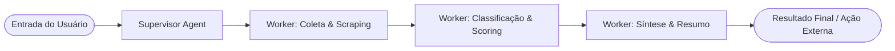
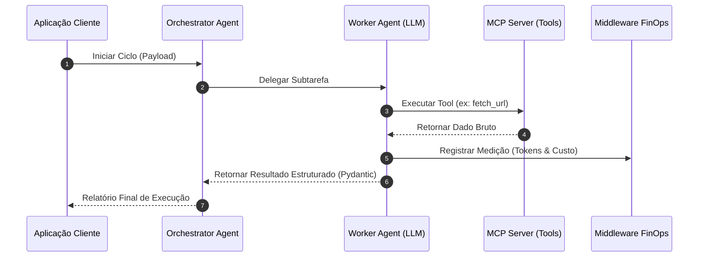

# 📚 Playbook 01: Getting Started & Fundamentos de Sistemas Agênticos

> **Módulo:** Engenharia de Sistemas Agênticos · **Público:** Desenvolvedores Full-Stack & Engenheiros de Dados

---

## 1. O que é um Sistema Agêntico?

Um **Sistema Agêntico** diferencia-se de uma chamada simples a uma LLM (Single Prompt) por possuir **autonomia de tomada de decisão**, capacidade de **uso de ferramentas (Tool Use / MCP)** e **orquestração de estado**.

Em vez de enviar todo o contexto para uma única prompt gigante, dividimos a solução em **agentes especializados** com papéis bem delimitados:



---

## 2. Padrões de Orquestração (Topologias)

Existem 3 topologias agênticas principais suportadas por este Starter Kit:

### A. Sequential Agent (Orquestração Sequencial)
Os agentes executam em linha montagem. A saída do Agente A torna-se a entrada do Agente B.
- *Exemplo:* Ingestão de texto $\rightarrow$ Classificação por relevância $\rightarrow$ Resumo final.

### B. Parallel Agent (Orquestração Paralela)
O supervisor dispara múltiplos agentes simultaneamente para acelerar I/O.
- *Exemplo:* Raspar 10 fontes noticiosas ou publicar em 5 redes sociais ao mesmo tempo.

### C. Loop Agent (Auto-correção / Validação)
O agente executa iterativamente até que uma condição de parada (ou score mínimo) seja atingida.
- *Exemplo:* Agente gerador de código $\rightarrow$ Agente linter $\rightarrow$ Se houver erros, envia de volta ao gerador.

---

## 3. O Ciclo de Vida de uma Execução Agêntica



---

## 4. Guia Prático: Como Criar seu Primeiro Agente

Para adicionar um novo agente especializado neste starter kit, siga 3 passos simples:

### Passo 1: Definir o Modelo de Dados (Pydantic v2)
Em `src/core/models.py`, crie os schemas estritos para os inputs e outputs do seu agente:

```python
from pydantic import BaseModel, Field

class SentimentInput(BaseModel):
    text: str = Field(..., min_length=10)

class SentimentOutput(BaseModel):
    sentiment: str  # positive, negative, neutral
    confidence: float
```

### Passo 2: Herdar de `BaseAgent`
Em `src/core/my_agent.py`, crie a classe herdeira implementando o método `_execute_internal`:

```python
from core.base_agent import BaseAgent

class SentimentAnalysisAgent(BaseAgent):
    def __init__(self):
        super().__init__(
            agent_name="sentiment_analyzer",
            model_name="gemini-2.0-flash"
        )

    async def _execute_internal(self, payload: SentimentInput) -> SentimentOutput:
        # TODO: Adicionar chamada real à API da LLM ou Mock
        return SentimentOutput(sentiment="positive", confidence=0.95)
```

### Passo 3: Registrar no Orquestrador
Adicione seu novo agente ao `SequentialOrchestrator` em `src/main.py`:

```python
orchestrator.add_step(sentiment_agent)
result = await orchestrator.run(initial_data)
```

---

## 💡 Armadilhas Comuns & Boas Práticas

> [!WARNING]
> **Evite Prompts Gigantes:** Não tente fazer classificação, tradução, sumarização e formatação em uma única prompt. Divida em agentes especializados para aumentar a assertividade e reduzir custos.

> [!TIP]
> **Use Structured Output:** Sempre exija respostas em JSON validadas via Pydantic para evitar erros de parse em produção.
