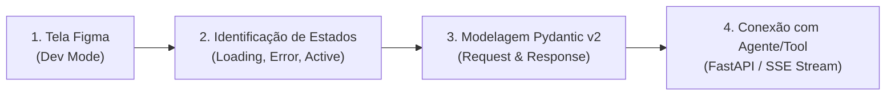

# 🎨 Playbook 02: Figma-to-Code Mapping & Design-to-Agent Translation

> **Módulo:** Interface & Agentes · **Público:** Desenvolvedores Full-Stack & UI/UX Engineers

---

## 1. Visão Geral

Uma das tarefas mais críticas em projetos de IA Corporativa é converter os requisitos visuais do designer (Figma) em **contratos de API REST/SSE**, **modelos de dados Pydantic v2** e **ferramentas de agentes autônomos**.

Este playbook ensina a metodologia passo a passo para extrair definições do **Figma Dev Mode** e transformá-las em arquitetura de backend agêntica.

---

## 2. Metodologia de Mapeamento em 4 Passos



---

## 3. Matriz de Mapeamento: Design vs Backend vs Agente

| Componente Figma / Frame | Estado Visual | Endpoint Backend (FastAPI) | Agente / Tool Acionada |
|---|---|---|---|
| **Header · Agent Status** | Badge Verde ("Ativo") / Cinza ("Pausado") | `GET /api/v1/agent/status` | `supervisor_agent.get_status()` |
| **Header · Toggle Switch** | Interactive Switch (On/Off) | `POST /api/v1/agent/toggle` | `supervisor_agent.toggle_lifecycle()` |
| **Cards Grid · Feed Notícias** | List Item com Score (0-100) & Badge | `GET /api/v1/news` | `search_similar_articles` (MCP DB) |
| **Card Item · Resumo IA** | Parágrafo de síntese | `GET /api/v1/news/stream` (SSE) | `summarizer_agent` (LLM Stream) |
| **Action Button · Aprovar** | Botão Primário ("Publicar Agora") | `PATCH /api/v1/news/{id}/status` | `publisher_agent` (Parallel Dispatcher) |

---

## 4. Exemplo Prático: Mapeando um Card de Feed

### A. Especificação do Figma (Dev Mode Inspector)
- **Título do Card:** String
- **Score Badge:** Numérico (0 a 100), se $\ge 75$ Badge Verde ("Relevante"), senão Badge Amarelo ("Em Revisão")
- **Resumo IA:** Texto (máximo 120 palavras)
- **Ações:** Botão "Aprovar" / Botão "Descartar"

### B. Tradução para Schema Pydantic v2

```python
from pydantic import BaseModel, Field, HttpUrl
from typing import Literal, List, Optional
from datetime import datetime

class FeedCardComponent(BaseModel):
    """Schema Pydantic correspondente exatamente aos dados exigidos pelo card no Figma."""
    id: int
    title: str = Field(..., description="Título exibido no topo do card")
    ai_score: int = Field(..., ge=0, le=100, description="Score que determina a cor da badge visual")
    status: Literal["publicado", "aguardando", "revisao", "descartado"]
    summary_text: str = Field(..., description="Texto gerado pela IA exibido no corpo do card")
    category_label: str
    tags: List[str]
    source_url: HttpUrl
    created_at: datetime
```

### C. Conectando ao SSE (Server-Sent Events) para Atualização sem Polling

No frontend React/Next.js, em vez de fazer polling manual a cada 5 segundos, conectamos ao endpoint SSE provido pelo backend:

```typescript
// Exemplo no Frontend (React)
useEffect(() => {
  const eventSource = new EventSource('/api/v1/news/stream');
  
  eventSource.addEventListener('new_article', (event) => {
    const newCard = JSON.parse(event.data);
    setFeedItems((prev) => [newCard, ...prev]);
  });

  return () => eventSource.close();
}, []);
```

---

## 💡 Boas Práticas de Design-to-Code Agêntico

1. **Evite Estados Impossíveis:** Mantenha os enums do Pydantic (`Literal[...]`) alinhados aos estados de UI desenhados no Figma.
2. **Streaming Progressivo:** Quando o agente estiver gerando resumos longos, utilize respostas em streaming (SSE) para exibir palavra por palavra no card da interface, melhorando a percepção de latência pelo usuário.
