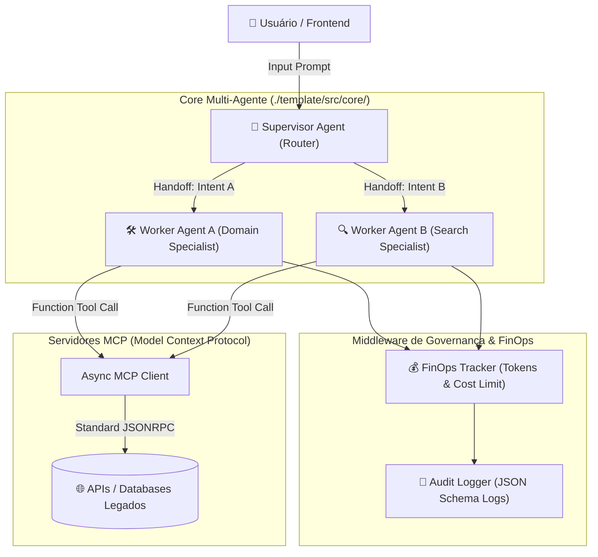

# 🎓 Mentor-IA Starter Kit: Orquestração Multi-Agente & Governança FinOps

> **Selo Pedagógico:** CoE AI Engineering Template · **Versão:** 1.0.0  
> **Stack:** Python 3.12+ · Google ADK / Gemini 3.5 Flash · Pydantic v2 · MCP Protocol  
> **Nível:** Intermediário a Avançado (Devs Full-Stack, Engenheiros de Dados e Arquitetos de IA)

---

## 🎯 Objetivos de Aprendizado & Mapa de Competências

Este **Starter Kit** foi desenvolvido para capacitar engenheiros de software na construção de ecossistemas agênticos corporativos, focando em robustez, desacoplamento e governança de custos.

 Ao concluir a exploração e implementação deste template, você dominará:
- [x] **Topologia de Agentes Hierárquicos:** Padrão Supervisor-Worker com handoff determinístico.
- [x] **Protocolo MCP (Model Context Protocol):** Desacoplamento entre lógica do agente e execução de ferramentas corporativas.
- [x] **Governança FinOps:** Limitação preventiva de tokens por sessão e rastreamento de custos por requisição.
- [x] **Design-to-Code:** Mapeamento de fluxos do Figma Dev Mode para contratos JSON Schema tipados em Pydantic v2.

---

## 🏗️ Arquitetura Conceitual



### 🎨 Design & Protótipo Figma (Interface)
- **Protótipo Interativo & Dev Mode:** [Acessar Protótipo no Figma](https://www.figma.com/file/mentor-ia-starter-kit-prototype)
- **Integração Design-to-Code:** Mapeamento de componentes e frames visuais para contratos tipados em Pydantic. Veja o detalhamento no playbook [./docs/02-figma-to-code.md](./docs/02-figma-to-code.md).

---

## ⚡ Guia Rápido de Início (Setup em 3 Passos)

### 1. Clonar e Navegar para o Starter Kit
```bash
cd template-mentor-ia/template
```

### 2. Criar Ambiente Virtual e Instalar Dependências
```bash
python -m venv .venv
# No Linux/macOS:
source .venv/bin/activate
# No Windows PowerShell:
.\.venv\Scripts\Activate.ps1

pip install pydantic google-adk python-dotenv
```

### 3. Configurar Variáveis e Executar
```bash
cp .env.example .env
python src/main.py
```

---

## 📂 Estrutura de Pastas do Repositório

```
./
├── README.md                          # Guia Principal do Starter Kit (Este arquivo)
├── docs/                              # Playbooks Didáticos Avançados
│   ├── 01-getting-started.md          # Fundamentos e ciclo de vida do agente
│   ├── 02-figma-to-code.md            # Integração Design-to-Code via Figma Dev Mode
│   └── 03-finops-and-governance.md    # Boas práticas de gestão de custos e auditoria
├── .antigravity/                      # Configurações do Assistente Antigravity
│   ├── agents.template.md             # Template declarativo de prompts e restrições
│   └── rules.starter.md               # Regras de engenharia comentadas
└── template/                          # Código Boilerplate Mínimo Executável
    ├── .env.example                   # Modelo de variáveis de ambiente documentado
    └── src/
        ├── main.py                    # Ponto de entrada CLI interativo
        └── core/
            ├── base_agent.py          # Classe base abstrata para agentes com FinOps
            └── orchestrator.py        # Orquestrador hierárquico exemplo (Supervisor/Worker)
```

---

## 📚 Próximos Passos Recomendados
1. Leia o [Playbook 01: Getting Started](./docs/01-getting-started.md) para compreender o ciclo de vida dos agentes.
2. Explore [docs/02-figma-to-code.md](./docs/02-figma-to-code.md) para aprender a transformar designs em contratos Pydantic v2.
3. Consulte [docs/03-finops-and-governance.md](./docs/03-finops-and-governance.md) para implementar observabilidade e limites de custos.

