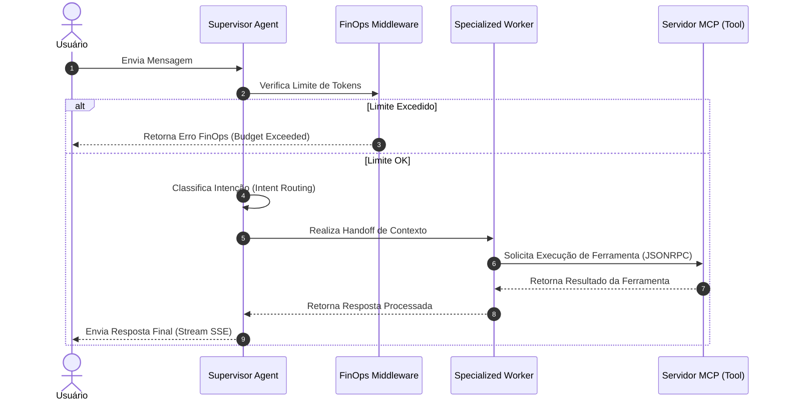

# 📖 Playbook 01: Fundamentos & Ciclo de Vida dos Agentes

> **Módulo:** Mentor-IA Core Principles  
> **Objetivo:** Compreender a diferença entre chamadas simples de LLM e Sistemas Agênticos Orquestrados.

---

## 1. O que é um Sistema Agêntico?

Diferente de um completion simples via API (onde o modelo apenas gera texto com base em um prompt estático), um **Agente Inteligente** possui:
1. **Percepção e Intenção:** Capacidade de analisar o input do usuário e decidir a melhor estratégia.
2. **Uso de Ferramentas (Tool Use / Function Calling):** Habilidade de invocar APIs externas para ler dados atualizados ou alterar estados em sistemas.
3. **Autonomia em Loop / Delegamento:** Capacidade de repassar o controle para sub-agentes especialistas quando o problema exige competências distintas.

---

## 2. Ciclo de Vida de uma Requisicão (Agêntica vs Tradicional)

---

## 3. Padrões de Design no Starter Kit

### Padrão 1: Separar Intenção de Execução (Supervisor/Worker)
Nunca force um único prompt a resolver todas as tarefas do sistema. O prompt do **Supervisor** deve apenas atuar como um **Router de Intenções**, delegando tarefas complexas para **Worker Agents** focados em escopos reduzidos.

### Padrão 2: Strict Typing com Pydantic v2
Toda entrada e saída de ferramenta agêntica deve ser validada estruturalmente. Isso impede injeções de prompt maliciosas e garante que ferramentas downstream recebam o tipo exato (ex: `int`, `UUID`, `HttpUrl`).

---

## 💡 Exercício Prático de Fixação
1. Abra o arquivo `template/src/core/orchestrator.py`.
2. Localize a função `route_intent`.
3. Adicione uma nova regra de roteamento para capturar a palavra-chave `"relatório"` e direcionar para um novo worker de relatórios.
