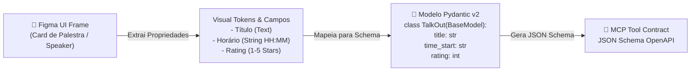

# 🎨 Playbook 02: Figma Dev Mode to Agent Code (Design-to-Code)

> **Módulo:** Mentor-IA Frontend & Contract Integration  
> **Objetivo:** Conectar componentes visuais projetados no Figma a endpoints de agentes autônomos.

---

## 1. Do Figma ao Contrato de Dados (Pydantic v2)

Ao inspecionar uma tela no **Figma Dev Mode**, o engenheiro de IA deve extrair os dados dinâmicos da interface e mapeá-los diretamente para esquemas Pydantic.



---

## 2. Passo a Passo de Mapeamento

### Passo 1: Identificar os Estados do Componente no Figma
Imagine um card de busca no Figma com os seguintes estados:
- **Default State:** Exibe resumo truncado e chips de tags.
- **Expanded State:** Exibe descrição completa e área de feedback por estrelas.
- **Loading / Skeleton State:** Enquanto o agente via SSE envia tokens.

### Passo 2: Traduzir para Pydantic v2
```python
from pydantic import BaseModel, Field
from typing import List

class ComponenteCardSchema(BaseModel):
    id: str = Field(..., description="ID extraído do componente no Figma")
    titulo: str = Field(..., min_length=1)
    descricao_truncada: str = Field(..., max_length=150)
    tags: List[str]
    is_expanded: bool = False
```

### Passo 3: Conectar ao Endpoint SSE Streaming
No frontend (React/Next.js/HTML), o componente consome a resposta progressiva enviada pelo agente através da API `EventSource`:

```typescript
// Exemplo de integração frontend com o agente
const eventSource = new EventSource('/api/v1/chat');

eventSource.addEventListener('token', (event) => {
    const data = JSON.parse(event.data);
    updateCardText(data.delta); // Atualiza a UI frame a frame
});
```

---

## 💡 Armadilha Comum (Pitfall)
> **Problema:** Tentar gerar HTML diretamente pelo LLM para renderizar na tela.  
> **Solução Correta:** O agente deve retornar **apenas dados tipados em JSON** ou **tokens de texto limpos**. A estilização e os componentes visuais devem ser mantidos 100% no código frontend.
