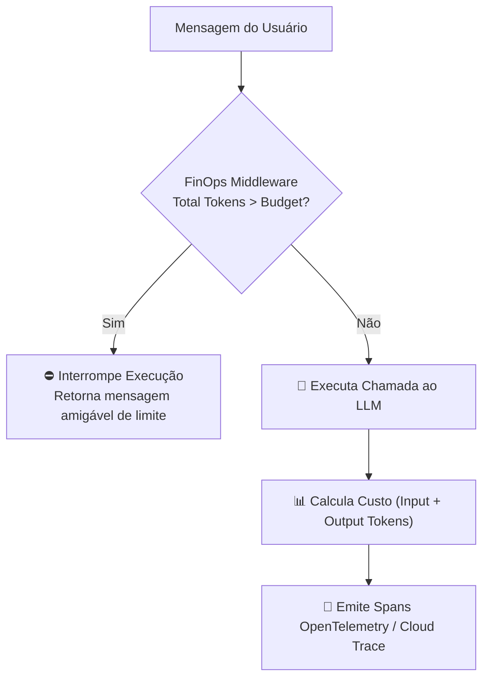

# 💰 Playbook 03: Governança FinOps & Gestão de Token Budget

> **Módulo:** Mentor-IA Governance & Operations  
> **Objetivo:** Garantir a sustentabilidade financeira e observabilidade de sistemas agênticos em produção.

---

## 1. Por que FinOps é Crítico em IA Agêntica?

Agentes autônomos podem entrar em loops de reflexão ou chamadas de ferramentas iterativas sem fim. Se não houver travamentos estritos no nível do código, uma única sessão pode consumir milhares de tokens em minutos, estourando orçamentos de infraestrutura.



---

## 2. Pilares da Governança FinOps no Starter Kit

### 1. Limite Preventivo por Sessão (Session Budgeting)
Configurado no motor base com um teto máximo de **8.000 tokens** por interação de usuário.

```python
MAX_TOKENS_PER_SESSION = 8_000
```

### 2. Monitoramento de Custos em Tempo Real
Rastreamento individual dos tipos de token:
- **Input Tokens:** $0.000075 / 1k (Gemini 3.5 Flash)
- **Output Tokens:** $0.000300 / 1k (Gemini 3.5 Flash)
- **Cached Tokens:** Desconto para prompts de sistema fixos mantidos em cache.

### 3. Log de Auditoria Estruturado (Audit Trail)
Toda transação agêntica grava uma linha JSON estruturada sem dados pessoais (PII):

```json
{
  "timestamp": "2026-08-16T14:30:00Z",
  "trace_id": "8f3b2a-...",
  "session_id": "sess-123",
  "input_tokens": 210,
  "output_tokens": 85,
  "estimated_cost_usd": 0.000041,
  "latency_ms": 340.5
}
```

---

## 3. Checklist de Produção FinOps

- [ ] Configurar alarme no Cloud Monitoring quando o consumo atingir 80% do budget diário.
- [ ] Ativar Context Caching para prompts de sistema com mais de 32k tokens.
- [ ] Aplicar throttling por IP no API Gateway para evitar abuso ou ataques de Negação de Serviço por Consumo (DoW - Denial of Wallet).
