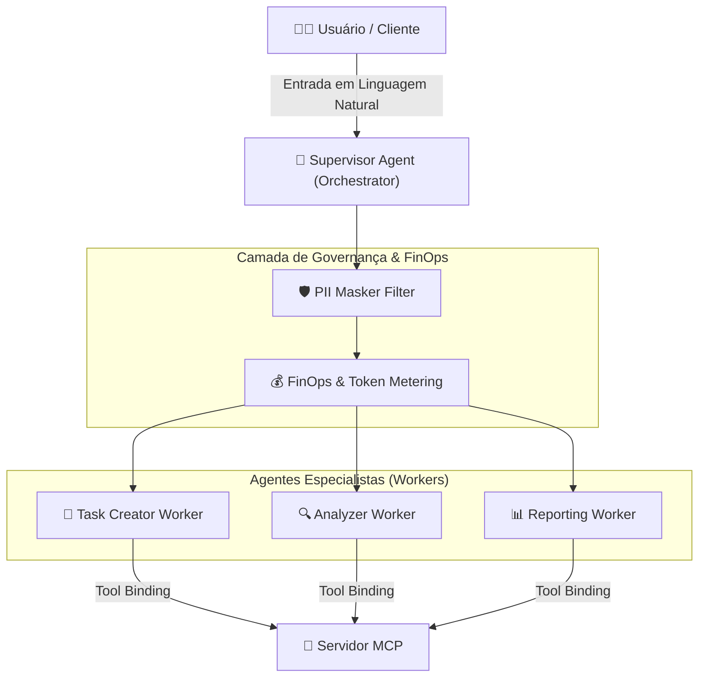

# 🎓 Mentor-IA Starter Kit: Orquestração Multi-Agente & Governança MCP

> **Selo Educacional:** Template Oficial CoE de IA & MLOps  
> **Nível:** Intermediário / Avançado (Engenheiros Full-Stack & MLOps)  
> **Stack Core:** Python 3.11+ | Google ADK | Gemini 3.5 | Pydantic v2 | Model Context Protocol (MCP)

---

## 📌 Visão Geral

Este **Starter Kit / Boilerplate** foi projetado para acelerar o aprendizado e a adoção de arquiteturas agênticas modernas, desacopladas e governadas. Ele ensina como estruturar sistemas multi-agente utilizando o padrão **Supervisor-Worker**, integrar ferramentas via o protocolo **MCP (Model Context Protocol)** e aplicar proteções rigorosas de **FinOps** e segurança de dados (PII Masking).



---

## 🎯 Mapa de Aprendizado & Competências

Ao explorar este kit, você desenvolverá as seguintes competências práticas:

1. **Design de Topologias Agênticas:** Implementação do padrão Supervisor-Worker desacoplado com handoffs claros.
2. **Integração com Protocolo MCP:** Vinculação estrita de ferramentas e endpoints REST via JSON Schema.
3. **Engenharia de Prompt & Personas:** Construção de System Prompts eficientes e determinísticos.
4. **Governança FinOps em IA:** Controle rigoroso de limite de tokens por chamada, teto orçamentário diário e cache semântico.
5. **Segurança & Conformidade:** Mascaramento dinâmico de dados PII (Emails, CPFs) antes do envio às LLMs.

---

## 🚀 Guia Rápido de Início (Setup em 3 Passos)

### Passo 1: Clonar o Repositório e Criar o Ambiente Virtual

```bash
cd template-mentor-ia/template
python -m venv venv
# No Linux/macOS:
source venv/bin/activate
# No Windows (PowerShell):
.\venv\Scripts\Activate.ps1
```

### Passo 2: Instalar as Dependências e Configurar o `.env`

```bash
pip install -r requirements.txt
cp .env.example .env
```

*Edite o arquivo `.env` e adicione sua chave de API da Google AI (`GOOGLE_API_KEY`).*

### Passo 3: Executar a Demonstração Interativa

```bash
python src/main.py
```

---

## 📂 Estrutura do Repositório Explicada

```
template-mentor-ia/
├── docs/                                  # Playbooks didáticos e tutoriais passo a passo
│   ├── 01-getting-started.md              # Fundamentos da arquitetura agêntica e ambiente
│   ├── 02-figma-to-code.md                # Conectando protótipos Figma Dev Mode aos agentes
│   └── 03-finops-and-governance.md        # Guia completo de FinOps, segurança PII e telemetria
│
├── .antigravity/                          # Templates de configuração do assistente Antigravity
│   ├── agents.template.md                 # Especificação declarativa dos agentes
│   └── rules.starter.md                   # Convenções de engenharia e diretrizes do CoE
│
└── template/                              # Código Boilerplate Mínimo Executável
    ├── .env.example                       # Exemplo detalhado de variáveis de ambiente
    └── src/
        ├── main.py                        # Ponto de entrada CLI interativo
        └── core/
            ├── base_agent.py              # Classe base abstrata com FinOps e PII Masking
            └── orchestrator.py            # Motor de orquestração hierárquica Supervisor-Worker
```
