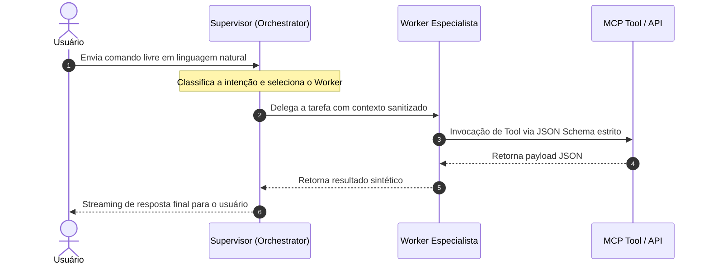

# 📘 Playbook 01: Fundamentos da Arquitetura Agêntica & Ciclo de Vida

> **Objetivo Pedagógico:** Entender o fluxo mental, o ciclo de vida e a estrutura do padrão Supervisor-Worker em sistemas agênticos de produção.

---

## 1. O Padrão Supervisor-Worker

Em soluções agênticas corporativas, colocar toda a responsabilidade em um único prompt gigante ("Monolithic Agent") gera alucinações, estouro de contexto e alta latência. 

A abordagem recomendada é o desacoplamento por **especialização**:

---

## 2. Ciclo de Vida de uma Requisicão Agêntica

1. **Ingestão & Sanitização (PII Filter):** O texto enviado pelo usuário passa por um filtro Regex/Presidio que substitui dados pessoais (Emails, CPFs) por tokens neutros antes de enviar para a LLM.
2. **Classificação de Intenção (Roteamento):** O Supervisor (`task_orchestrator`) analisa a frase e determina qual Worker especialista é qualificado para a execução.
3. **Controle de Throttling & FinOps:** O middleware verifica se a chamada respeita o limite de tokens (`MAX_TOKENS_PER_AGENT_CALL`) e o orçamento diário acumulado.
4. **Binding & Execução de Tools:** O Worker escolhido executa as chamadas de função expostas pelo protocolo MCP ou cliente HTTP REST.
5. **Auditoria & Resposta:** A resposta é formatada, os custos são contabilizados no log estruturado e a resposta final é entregue.

---

## 3. Armadilhas Comuns & Como Evitá-las

- ❌ **Armadilha:** Permitir que agentes tomem ações destrutivas no banco (ex: `DROP TABLE` ou `DELETE`) sem confirmação humana.
  - ✅ **Solução:** Use privilégios restritos de leitura/escrita no servidor MCP e validação de schema Pydantic v2.
- ❌ **Armadilha:** Fazer chamadas recursivas infinitas entre agentes sem condição de parada.
  - ✅ **Solução:** Imponha um limite de `max_iterations = 3` no orquestrador.
