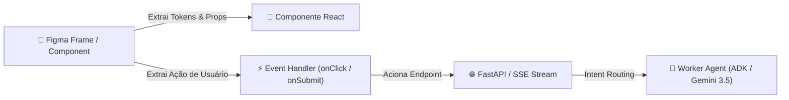

# 🎨 Playbook 02: Design-to-Code — Do Figma ao Endpoint Agêntico

> **Objetivo Pedagógico:** Mapear elementos visuais e fluxos de telas definidos no Figma Dev Mode diretamente para componentes React e ações de agentes de IA.

---

## 1. O Fluxo de Mapeamento

Ao construir aplicações modernas alimentadas por IA, o protótipo visual do Figma deve ditar não apenas a UI, mas também as **intenções do usuário** que serão acionadas via backend/agentes:

---

## 2. Tabela de Mapeamento Prático

| Componente Figma | Componente Frontend React | Trigger de Ação | Endpoint Backend / Tool MCP | Agente Especialista |
|---|---|---|---|---|
| **Botão "+ Nova Tarefa"** | `<TaskFormModal />` | `onSubmit` | `POST /api/v1/tasks` | `task_creator_agent` |
| **Input Lenguagem Natural** | `<AgentChatInput />` | `onKeyPress (Enter)` | `POST /api/v1/agents/execute` | `task_orchestrator` |
| **Checkbox de Conclusão** | `<TaskRowCheckbox />` | `onChange` | `PATCH /api/v1/tasks/{id}/toggle` | `overdue_analyzer_agent` |
| **Dashboard de Métricas** | `<MetricsSummaryCard />` | `useEffect (Mount)` | `GET /api/v1/metrics/summary` | `reporting_agent` |

---

## 3. Boas Práticas para Feedback de Interface (UX Agêntico)

1. **Indicador de Processamento ("Thinking State"):**
   - Sempre exiba um componente de *loading skeleton* ou indicador "O agente está analisando..." ao disparar chamadas para agentes de IA.
2. **Server-Sent Events (SSE) para Streaming:**
   - Utilize escuta SSE (`EventSource`) no React para atualizar a interface em tempo real à medida que o agente toma ações intermediárias (ex: `agent.thinking` -> `agent.action` -> `agent.done`).
