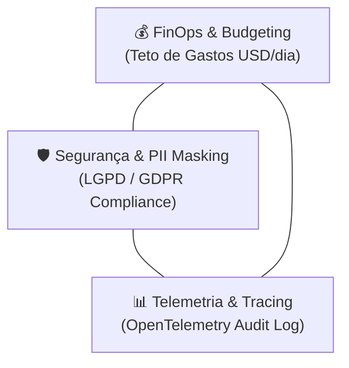

# 💰 Playbook 03: FinOps, Governança & Segurança em IA Corporativa

> **Objetivo Pedagógico:** Dominar os mecanismos de mitigação de custos de inferência, limitação de consumo de tokens, mascaramento de dados PII e rastreamento de custos por sessão.

---

## 1. O Triângulo de Governança em IA



---

## 2. Estratégias FinOps Recomendadas

### 2.1 Roteamento Inteligente por Custo/Complexidade
Não utilize o modelo mais caro (`Gemini 3.5 Pro` ou `GPT-4o`) para tarefas simples de classificação ou extração de texto. 

- **Tarefas de Baixa Complexidade (CRUD, extração, classificação):** Use `gemini-3.5-flash` (~$0.000075 / 1K tokens).
- **Tarefas de Alta Complexidade (análise de dados, relatórios sintéticos):** Use `gemini-3.5-pro`.

### 2.2 Limites de Throttling Rigorosos
Defina travas no código para evitar requisições descontroladas:
- **Hard Limit por Chamada:** 8.192 tokens.
- **Soft Limit por Sessão:** 65.536 tokens.
- **Budget Diário Global:** USD $5.00/dia.

---

## 3. Mascaramento Dinâmico de PII (Personally Identifiable Information)

Antes de enviar qualquer prompt para provedores públicos de LLM, filtre dados sensíveis:

```python
# Exemplo conceitual de sanitização
def sanitize_prompt(prompt: str) -> str:
    # Substitui emails por token neutro
    prompt = re.sub(r'[a-zA-Z0-9_.+-]+@[a-zA-Z0-9-]+\.[a-zA-Z0-9-.]+', '[PII_EMAIL]', prompt)
    # Substitui CPFs por token neutro
    prompt = re.sub(r'\b\d{3}\.\d{3}\.\d{3}-\d{2}\b', '[PII_CPF]', prompt)
    return prompt
```
